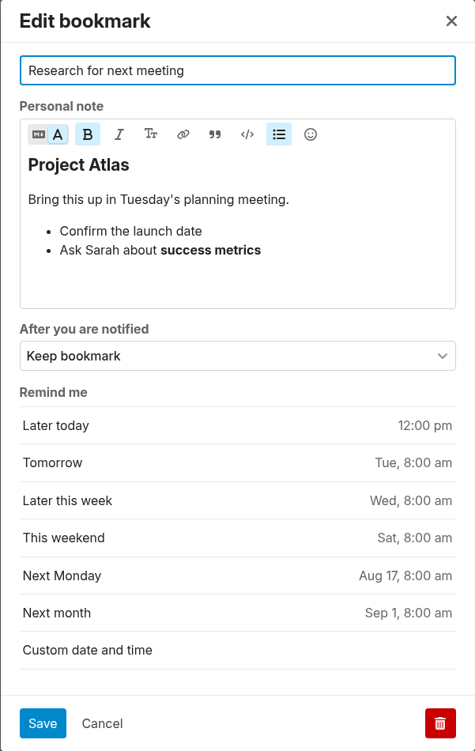

# Discourse Bookmark Notes

Discourse Bookmark Notes turns bookmarks into private, personal notes attached to posts and other bookmarkable content.

## Functionality

- Uses the bookmark's existing name as the note title.
- Adds a personal note body using Discourse's Markdown editor, including a live rendered preview.
- Keeps each note private to the user who owns the bookmark. Multiple users can bookmark the same post and keep completely independent notes.
- Preserves Discourse's existing bookmark reminders, auto-delete preferences, bookmark controls, and bookmarks list.
- Supports creating, updating, and removing a note without removing its bookmark.

## Pro extension

[Discourse Bookmark Notes Pro Ext](https://github.com/merefield/discourse-bookmark-notes-pro-ext) is an optional extension available to GitHub Sponsors as a thank-you for supporting ongoing development. Individual sponsors on the $7/month tier receive access to the Pro extension and its installation details.

**[Sponsor on GitHub to get Bookmark Notes Pro](https://github.com/sponsors/merefield)**

Once you have access, install the Pro extension alongside this base plugin to enable the additional features.

All Pro features have their own site settings and include:

- A private, collapsible panel below a bookmarked post showing the full rendered note, with a setting to start panels collapsed.
- Personal notes appended to entries on the current user's bookmarks activity page.
- Bookmark search extended to include the current user's bookmark titles and personal-note bodies when using `in:bookmarks`.
- A sortable **Notes** column on topic lists, indicating when the current user has a note on the topic or any of its posts.

## Privacy and storage

Note bodies are stored in a plugin-owned `BookmarkNote` record with a one-to-one relationship to the core `Bookmark`. They are loaded and saved through owner-authorized endpoints. The base plugin exposes only the bookmark ID and note title to the owner on topic pages; the Pro extension adds the rendered note body only when its private post panel is enabled.
